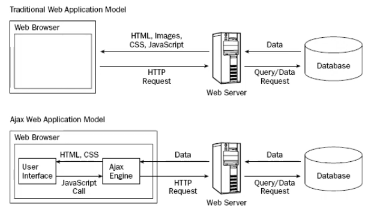

# Fundamentos JavaScript

1.  [Tipos de Datos](01_tipos_de_datos.md)
1.  [Estructuras Control](02_estructuras_control.md)
1.  [Programacion Orientada a Objetos](03_poo.md)
1.  [Objetos y funciones del Lenguaje](04_objetos_y_funciones.md)
1.  [Ejercicios de Logica de Programación](05_ejercicios_logica.md)
1.  [Programacion Asincrona](06_programacion_asincrona.md)
1.  [Nuevos Tipos y Caracteristicas](07_nuevos_tipos_y_caracteristicas.md)
1.  [This, Call, Apply y Bind](08_this_call_apply_bind.md)
1.  [JSON - JavaScript Object Notation](09_json.md)
1.  [DOM - Document Object Model](10_dom.md)
1.  [AJAX - Asynchronous JavaScript & XML](11_ajax.md)

## AJAX Asynchronous JavaScript and XML

> -   [Metodos Nativos](11_ajax.md#metodos-nativos)
> -   [Librerias Externas](11_ajax.md#librerias-externas)
> -   [Objeto XMLHttpRequest](11_ajax.md#objeto-xmlhttprequest)
> -   [API Fetch](11_ajax.md#api-fetch)
> -   [API Fetch con Async-Await](11_ajax.md#api-fetch-con-async-await)
> -   [Axios](11_ajax.md#axios)
> -   [Axios con Async-Await](11_ajax.md#axios-con-async-await)



### Metodos Nativos

-   [ActiveXObject (IE8 e inferiores) [Deprecado]]()
-   [XMLHttpRequest](11_ajax.md#objeto-xmlhttprequest)
-   [API Fetch](11_ajax.md#api-fetch)

### Librerias Externas

-   [jQuery.ajax()]()
-   [Axios](11_ajax.md#axios)
-   etc.

**_Ajax_** no es una tecnología en sí mismo. En realidad, se trata de varias tecnologías independientes que se unen:

-   **HTML** y **CSS**, Para crear una presentación basada en estándares.
-   **DOM**, para la interacción y manipulación dinámica de la presentación.
-   **HTML**, **XML**, **JSON**, para el intercambio y la manipulación de información.
-   **XMLHttpRequest** o **Fetch**, para el intercambio asíncono de información.
-   **JavaScript**, para unir todas las demás tecnologías.
-   **Estado de la petición**
    -   _*READY_STATE_UNINITIALIZED = 0*_
    -   _*READY_STATE_LOADIND = 1*_
    -   _*READY_STATE_LOADED = 2*_
    -   _*READY_STATE_INTERACTIVE = 3*_
    -   _*READY_STATE_COMPLETE = 4*_
-   **Códigos de Estado de respuesta HTTP**
    -   Respuestas Informativas **_(100-199)_**
    -   Respuestas satisfactorias **_(200-299)_**
    -   Redirecciones **_(300-399)_**
    -   Errores de los clientes **_(400-499)_**
    -   Errores de los servidores **_(500-599)_**

## Objeto XMLHttpRequest

```Javascript
// P1: Instanciar el objet XMLHttpRequest
const xhr = new XMLHttpRequest(),
    $xhr = document.getElementById('xhr'),
    $fragment = document.createDocumentFragment();

// P2: Asignarle axhr los eventos de la peticion
xhr.addEventListener('readystatechange', e => {
    if (xhr.readyState !== 4) return;

    if (xhr.status >= 200 && xhr.status < 300) {
        let json = JSON.parse(xhr.responseText)

        json.forEach(el => {
            const $li = document.createElement('li');
            $li.innerHTML = `${el.name} -- ${el.email} -- ${el.phone}`;
            $fragment.appendChild($li)
        });

        $xhr.appendChild($fragment)
    } else {
        let message = xhr.statusText || 'Ocurrió un error'
        $xhr.innerHTML = `Error ${xhr.status}: ${message}`
    }
    console.log("Este mensage cargara de cualquier forma");
})

// P3: Abrir la petición (endpoint)
// url_api = 'https://jsonplaceholder.typecode.com/users'
url_api = 'assets/users.json'
xhr.open('GET', url_api)

// P4: Enviar la petición
xhr.send();
```

## API Fetch

```Javascript
const $fetch = document.getElementById('fetch'),
    $fragment = document.createDocumentFragment();

// url_api = 'https://jsonplaceholder.typecode.com/users'
url_api = 'assets/users.json'

fetch(url_api)
    .then(res => {
        return res.ok ? res.json() : Promise.reject(res)
    })
    .then(json => {
        json.forEach(el => {
            const $li = document.createElement('li');
            $li.innerHTML = `${el.name} -- ${el.email} -- ${el.phone}`;
            $fragment.appendChild($li);
        });

        $fetch.appendChild($fragment)
    } )
    .catch(err => {
        let message = err.statusText || 'Ocurrió un error'
        $fetch.innerHTML = `Error ${err.status}: ${message}`
    })
    .finally(() => {
        console.log("Este mensage se ejecutara independientemente de la Promesa Fetch");
    } )
```

## API Fetch con Async-Await

```Javascript
const $fetchAsync = document.getElementById('fetch-async'),
        $fragment = document.createDocumentFragment();

// url_api = 'https://jsonplaceholder.typecode.com/users'
url_api = 'assets/users.json'

function figure(data) {
    data.forEach(el => {
        const $li = document.createElement('li');
        $li.innerHTML = `${el.name} -- ${el.email} -- ${el.phone}`;
        $fragment.appendChild($li)
    });
    return $fragment
}

async function getData() {
    try {
        let res = await fetch(url_api);
        if (!res.ok) throw { status: res.status, statusText: res.statusText };

        let json = await res.json();
        $fetchAsync.appendChild(figure(json))

    } catch (err) {
        // console.log("Estoy en el catch", err);
        let message = err.statusText || 'Ocurrió un error'
        $fetchAsync.innerHTML = `Error ${err.status}: ${message}`

    } finally {
        console.log("Este mensage se ejecutara independientemente del try-catch");
    }
}

getData()
```

## Axios

```Javascript
const $axios = document.getElementById('axios'),
    $fragment = document.createDocumentFragment();

// url_api = 'https://jsonplaceholder.typecode.com/users'
url_api = 'assets/users.json'

function figure(data) {
    data.forEach(el => {
        const $li = document.createElement('li');
        $li.innerHTML = `${el.name} -- ${el.email} -- ${el.phone}`;
        $fragment.appendChild($li)
    });
    return $fragment
}

axios.get(url_api)
    .then(res => {
        let json = res.data;
        $axios.appendChild(figure(json))
    })
    .catch(err => {
        // console.log(err.response);
        let message = err.response.statusText || 'Ocurrió un error'
        $axios.innerHTML = `Error ${err.response.status}: ${message}`
    })
    .finally(() => {
        // console.log("Este mensage se ejecutara independientemente del try-catch");
    })
```

## Axios con Async-Await

```Javascript
const $axiosAsync = document.getElementById('axios-async'),
    $fragment = document.createDocumentFragment();

// url_api = 'https://jsonplaceholder.typecode.com/users'
url_api = 'assets/users.json'

function figure(data) {
    data.forEach(el => {
        const $li = document.createElement('li');
        $li.innerHTML = `${el.name} -- ${el.email} -- ${el.phone}`;
        $fragment.appendChild($li)
    });
    return $fragment
}

async function getData() {
    try {
        let res = await axios.get(url_api);
        let json = await res.data;

        $axiosAsync.appendChild(figure(json))

    } catch (err) {
        let message = err.response.statusText || 'Ocurrió un error'
        $axiosAsync.innerHTML = `Error ${err.response.status}: ${message}`
    } finally {
        // console.log('Finally');
    }
}

getData()
```
